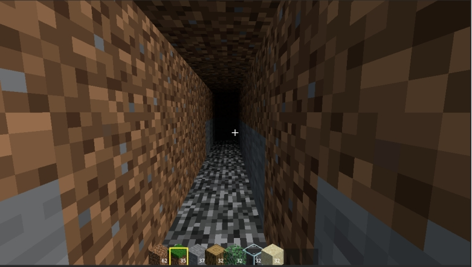
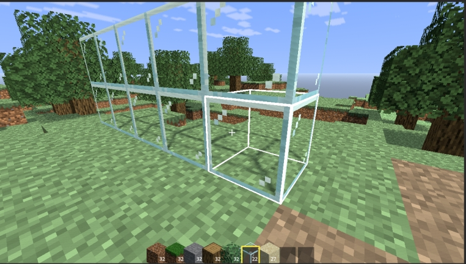
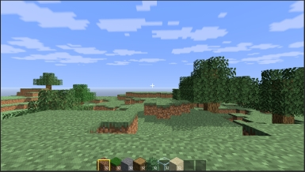
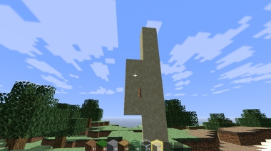

# VoxelSandbox · 体素沙盒

> 基于 **Godot 4.6** 从零实现的体素（Voxel）沙盒游戏原型 —— 程序化网格、纹理图集、自定义 Shader 与交互系统的完整实践。

[](https://godotengine.org)
[](https://docs.godotengine.org)
[](LICENSE)

一个使用 **GDScript + GDShader** 手写的类 Minecraft 体素沙盒原型：支持地形生成、区块流式加载、方块破坏/放置、物品掉落与拾取、快捷栏、昼夜循环与云层，所有渲染核心（网格构建、面剔除、纹理图集、光照着色器）均为底层手动实现，不依赖任何第三方体素插件。

## 截图展示

<p align="center">
  
  
  <br/>
  
  
</p>

---

## 功能特性

- 🧱 **8 种方块**：草方块、泥土、石头、橡木原木、树叶、基岩、玻璃、沙子，全部通过 `BlockData` 资源（`.tres`）配置，新增方块只需添加贴图 + 资源配置文件
- 🌍 **程序化地形生成**：Simplex 噪声高度图 + **4 种群系**（平原 / 森林 / 干旱 / 沙漠）+ 橡树生成，支持随机种子
- 📦 **区块流式加载**：以玩家为中心按半径加载/卸载 16×16 区块，网格重建与碰撞生成按队列节流，避免卡顿
- ⛏️ **方块交互**：3D DDA 射线拾取，左键破坏、右键放置（含玩家占位碰撞检测），准星高亮线框
- 🎒 **物品系统**：方块掉落为 3D 小方块实体（重力、落地悬浮、磁铁吸附、堆叠拾取），9 格快捷栏（数字键/滚轮切换、Q 丢弃），图标由 **SubViewport 离屏渲染**动态生成
- 🏜️ **沙子重力**：连续沙柱整体打包为物理实体下落，触底逐格回填，解决并发下落丢块问题
- ☀️ **昼夜循环**：ProceduralSky 天空渐变、太阳与 8 张月相贴图、方向光阴影昼夜过渡、多层云 Shader、环境光同步
- 🕳️ **洞穴天光传播**：BFS 从列顶向六方向扩散天光，跨区块采样邻居缓存，实现洞穴明暗渐变
- 🚶 **玩家控制器**：CharacterBody3D 胶囊体碰撞、重力跳跃、疾跑、双击空格切换飞行模式

## 技术亮点

| 模块 | 实现要点 |
| --- | --- |
| 程序化网格 | 手写顶点/索引缓冲（`ArrayMesh`），按列字典存储体素，暴露面检测 + **面剔除**，仅生成可见面 |
| 纹理图集 | 运行时将各贴图拼接为多行 Atlas（第 0 行基础纹理 / 第 1 行覆盖层），tile 映射烘焙进 `.tres`，兼容导出 |
| 自定义 Shader | `voxel_lit.gdshader`：Lambert 漫反射、**群系染色 colormap**、草侧面覆盖层叠加、`ALPHA_SCISSOR_THRESHOLD` 镂空（玻璃/树叶）、天光衰减；顶点属性（COLOR/UV2）作为 CPU→GPU 数据通道 |
| 射线拾取 | 3D DDA 体素遍历，处理边界归属与起始偏移，支持背向命中 |
| 性能优化 | 区块流式节流、近区碰撞、网格重建队列、SubViewport 图标缓存、按列 Y 范围加速查询 |

## 操作说明

| 操作 | 按键 |
| --- | --- |
| 移动 | `W` `A` `S` `D` |
| 跳跃 / 飞行上升 | `Space` |
| 飞行模式切换 | 双击 `Space` |
| 疾跑 | `Shift` |
| 飞行下降 | `Ctrl` |
| 破坏方块 | 鼠标左键 |
| 放置方块 | 鼠标右键 |
| 丢弃物品 | `Q` |
| 切换快捷栏 | `1`~`9` / 鼠标滚轮 |
| 释放 / 捕获鼠标 | `Esc` |

## 项目结构

```
voxel-sandbox/
├── src/
│   ├── voxel/        # 体素核心：世界管理、区块网格、方块注册表、图集构建
│   │   ├── voxel_world.gd      # 世界中枢：流式加载、地形生成、DDA拾取、交互
│   │   ├── voxel_chunk.gd      # 区块：面剔除 + 程序化网格 + BFS天光缓存 + 碰撞
│   │   ├── block_registry.gd   # 方块注册表：扫描 .tres 加载 BlockData
│   │   ├── block_data.gd       # 方块数据资源（渲染/剔除属性可配置）
│   │   ├── voxel_types.gd      # 体素类型与面方向枚举
│   │   └── atlas_builder.gd    # 运行时纹理图集拼接
│   ├── player/
│   │   └── player_controller.gd  # 第一人称/飞行双模式控制器 + 物品交互
│   ├── world/
│   │   ├── sky_controller.gd   # 昼夜循环、天体、云层、环境光
│   │   ├── falling_block.gd    # 沙子整柱下落实体
│   │   └── item_drop.gd        # 掉落物实体（物理、吸附、拾取）
│   └── ui/
│       ├── hotbar.gd               # 9格快捷栏 UI
│       └── block_preview_renderer.gd  # SubViewport 3D 方块图标渲染
├── shaders/
│   ├── voxel_lit.gdshader   # 体素方块光照/染色/镂空着色器
│   └── clouds.gdshader      # 云层着色器
├── scenes/                 # 主场景、快捷栏、掉落物、下落实体场景
├── resources/
│   ├── blocks/             # 方块定义（*.tres）
│   └── textures/           # 方块贴图、群系 colormap、环境贴图
├── docs/                   # 图形学大作业报告、实现文档
└── project.godot           # Godot 4.6 项目配置（Forward Plus）
```

## 运行方式

1. 安装 **Godot 4.6**（标准版，Forward Plus 渲染管线）
2. 使用 Godot Project Manager 导入本项目目录，打开 `project.godot`
3. 运行主场景 `res://scenes/main.tscn`（已在配置中设为默认主场景）
4. Windows 桌面端导出预设已包含在 `export_presets.cfg` 中

> 依赖引擎内置的 Jolt Physics（`project.godot` 已配置），无需额外插件；纹理导入需保持 Nearest（像素风）过滤。

## 文档

- [图形学大作业报告](docs/图形学大作业报告%20-%20体素沙盒%20(Voxel%20Sandbox).md) —— 算法原理、开发记录与问题排查
- [体素沙盒实现文档](docs/体素沙盒实现文档.md) —— 各系统实现细节与代码说明

## License

[MIT](LICENSE) © 2026 MortusC
